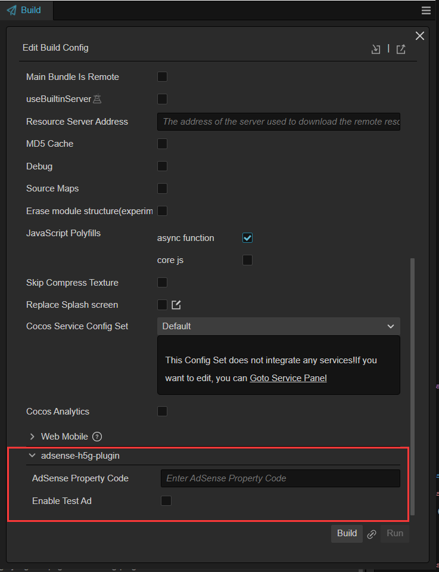

# AdSense H5 Games Ads Plugin

## About

Google AdSense is a program run by Google through which website publishers in the Google Network of content sites serve text, images, video, or interactive media advertisements that are targeted to the site content and audience. These advertisements are administered, sorted, and maintained by Google. They can generate revenue on either a per-click or per-impression basis. This plugin allows you to quickly integrate AdSense H5 game ads into your H5 games and currently supports both web-mobile and web-desktop platforms.

## Quick Start

First, refer to [the official Cocos Creator documentation](https://docs.cocos.com/creator/manual/zh/editor/extension/install.html) to add this plugin to the Cocos Creator extension manager and start the plugin.

Then you can see the configuration on the build panel Fill out the corresponding ad code configuration to integrate this function.

<!-- 
You can get the attribute codes by referring to [the documentation on the forum for obtaining Adsense attribute codes](https://support.google.com/adsense/answer/9274019). -->

For more information about Google AdSense, please refer to [the official website](https://www.google.com/adsense/new/u/0/pub-4552344828371429/onboarding).
